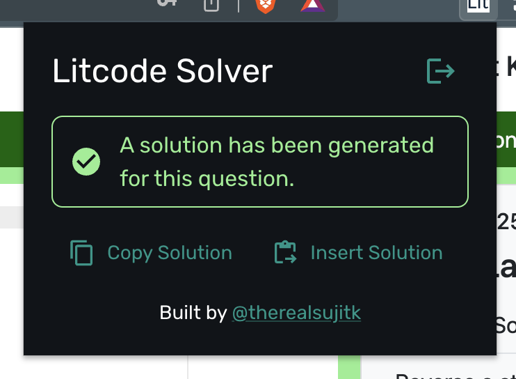
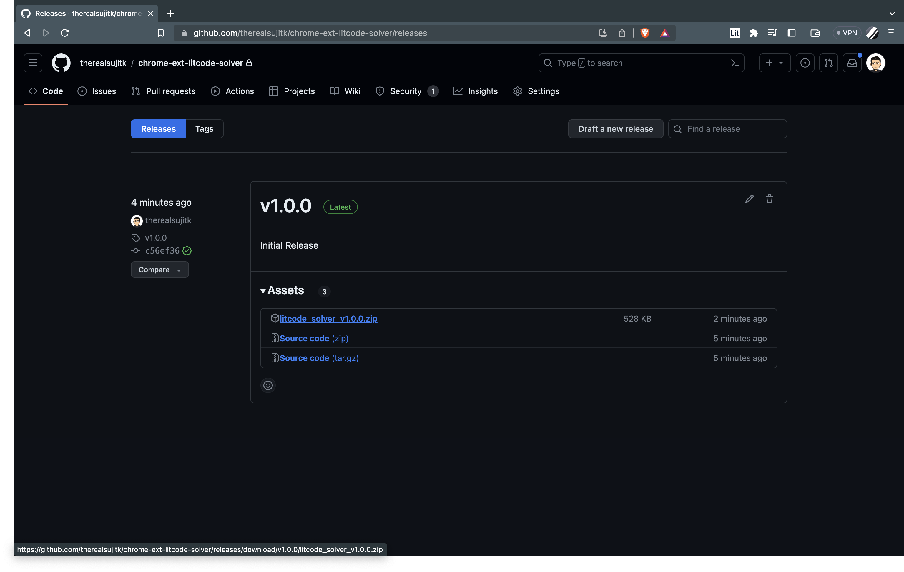
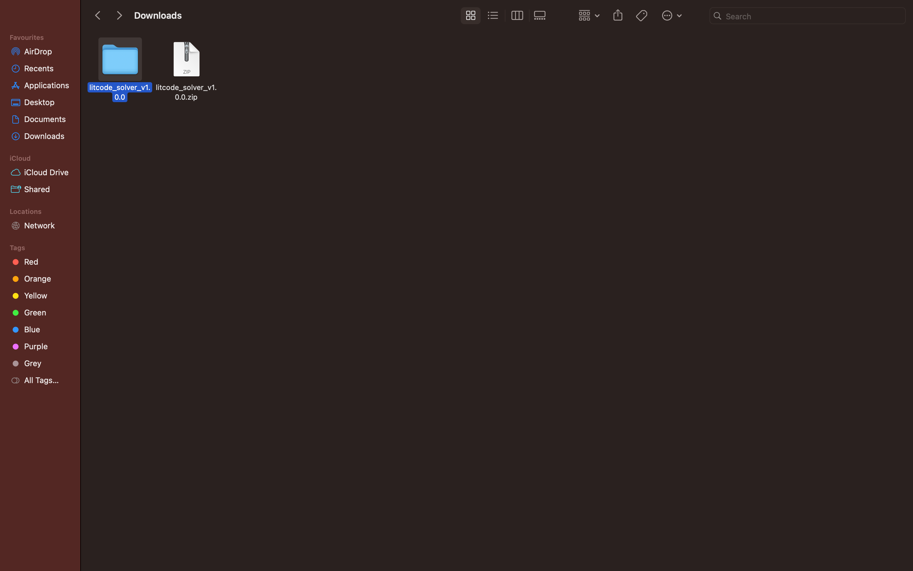
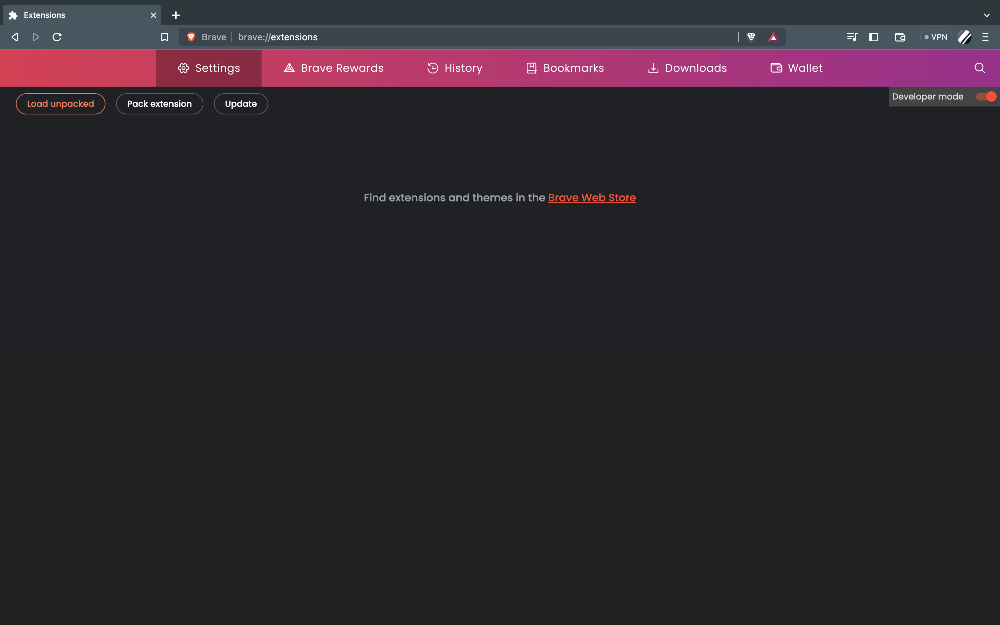
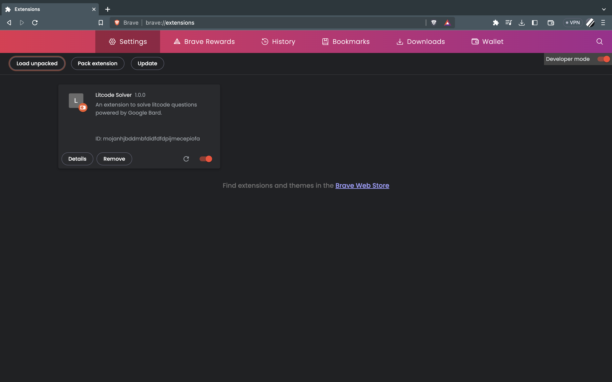
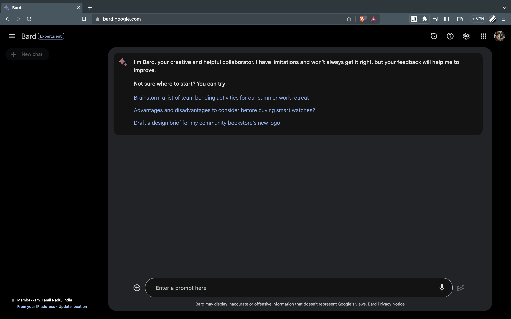
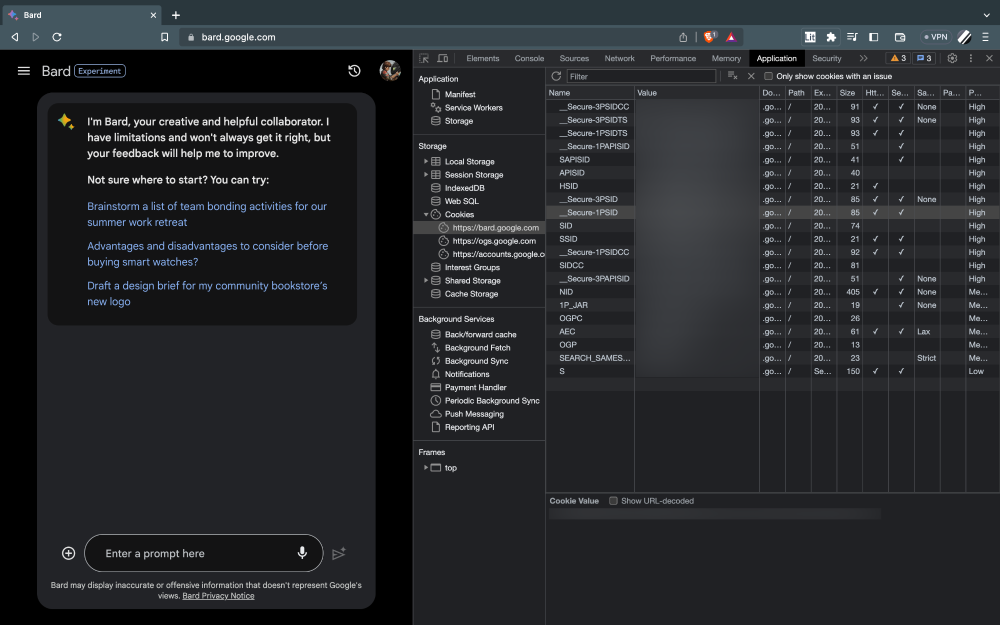
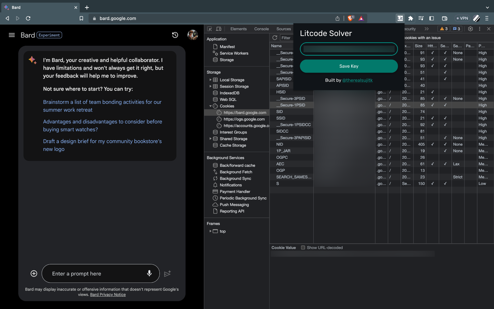

# Litcode Solver

 

A Chromium extension powered by [Google Bard](https://bard.google.com) to solve [Litcode](https://litcoder.azurewebsites.net/) questions.

## Installing the extension

1. Navigate to [Releases](https://github.com/therealsujitk/chrome-ext-litcode-solver/releases) and download the latest zip file under **Assets**.
    
2. Unzip the downloaded file into a folder and move the folder to an appropriate directory.
    
3. Go the [chrome://extensions](chrome://extensions) in your Chromium browser and enable **Developer Mode**.
    
4. Click on **Load unpacked** and select the folder that you unzipped.
    

## Setting up the extension

1. Go to [bard.google.com](https://bard.google.com) in your browser.
    
2. Open Developer Tools > Application > Cookies > https://bard.google.com and copy the value for the **__Secure-1PSID** key.
    
3. Open the extension, paste the value and click **Save Key**.
    
